# Azure - Considerations for Dev/Test "Sandboxes"

 
 

    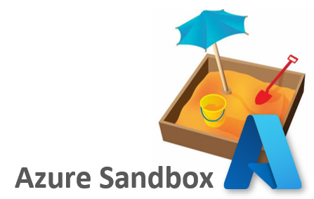

  

## **Overview**
This guide is intended to provide considerations when designing an Azure sandbox solution for your organizations Microsoft Azure focused cloud development teams. It will guide you through a thought process which is intended to help map out the reguirements in a logical way and also to provide some ideas of how to meet the various scenarios and needs of both the cloud development teams and Center IT Teams.

 

> **Note:** This is not a formal Microsoft recommendation but rather an opinion based upon experiances I've had when trying to solve these challenges with customers I've worked with and those of my fellow Cloud Solution Architects. 

 

## **What is a sandbox and why do organizations need them?**
So what is a sandbox? No, it's not only a pit fall of sand for the kids to play in, it's also a reference to a "play area" for developers to play in, or more importantly - learn, build, test and innovate - in this case, on the Microsoft Azure cloud. 

According to [Wikipedia][Wikipedia]... 

- *A sandbox is a testing environment that isolates untested code changes and outright experimentation from the production environment or repository, in the context of software development including Web development, Automation and revision control.*

As everyone should know by now, developers and Production environments do not mix. No disrespect to developers (which are awesome by the way), but it's imperative that access and changes to Production systems is kept under tight control. It is also imperative that an organisation can innovate and grow at the pace it needs to within well defined, well managed guardrails. The intent of sandbox environments is to provide a safe enviroment that meets developers needs when it comes to learning, testing and innovation while protecting an organizations data and services.

 

## **Sandbox Profiles**
Like a lot of situations, there is not a 'one-size-fits-all' solution when it comes to cloud development sandboxes. On the one hand we have cloud developers that want to learn, build, test and innovate quickly. Then on the other hand, an organization needs to ensure that any development activity does not increase the risk of [data exfiltration][data exfiltration], exposes any security vulnerabilities, or put their organization at risk.

There is a need to balance flexibility and security. Acknowledging that there is not a 'one-size-fits-all' solution, we can see that not one, but multiple sandbox scenarios are required to meet both ends of the spectrum, and also fill the gap in between.

These are some guiding principles that I've seen work well: 

- The more connected the sandbox environment needs to be to other environments, the more it should be subject to stronger controls and be managed by a Central IT Team rather than developers. This is true for example if there needs to be network connectivity to a Production or other restricted environment.
 - The more flexibility developers need within a sandbox environment, the more likely it is that the environmnet should be isolated from other environments.  

Like many things in life, you can't keep everyone happy all the time, and finding the right balance can be tricky. There is however an approach that can go a long way to satisfying most requirements, and that is to consider, at minimum, the following three types of sandbox types:
1. [**Highly Managed Sandbox** - From a developer’s perspective, things are mostly managed **for them** within the sandbox.](#Highly-Managed-Sandbox)
2. [**Lightly Managed Sandbox** - From a developer’s perspective, this is the **middle ground** where management is a **responsibly shared** between developers and Central IT Teams.](#Lightly-Managed-Sandbox)
3. [**Isolated Sandboxes (Dedicated)** - From a developer’s perspective, things are mostly managed **by them** within the sandbox.](#Isolated-Sandboxes---Dedicated)

    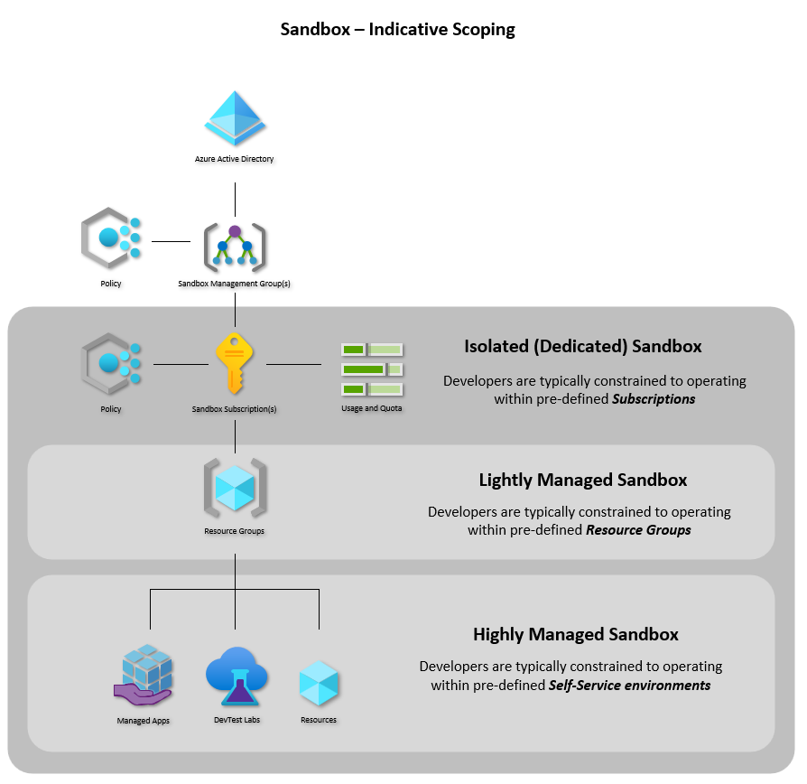

> **Note:** For a side-by-side table view of the various sandbox types, [download this comparison summary][comparison] PDF.

 

---

 

    

### **Highly Managed Sandbox:**
From a developer’s perspective, things are mostly managed **for them** within this type of sandbox environment. A 'Highly Managed Sandbox' is designed mostly to provide self-service capabilities to developers including virtual machine provisioning, and curated solutions that are managed on their behalf.

This type of sandbox is intended for individual developers and/or development teams that require relatively simple and quick stand-up time typically through the use of some form of self-service capability, and would prefer someone else to cover most of the management overhead on their behalf.

Because this type of sandbox is more tightly controlled and is highly managed by a Centeral IT Team, it is more likely acceptable that there could be some form of networking connectivity back into Production and/or other restrictive environments.

 

> **Note:** Although self-service services can be very benefitual to developers and help them get moving quickly, organizations need to be aware of the time and effort involved as it can be a long journey to build up a catalog of services and reusable IaC (Infrastructure-as-Code) resources.

 

    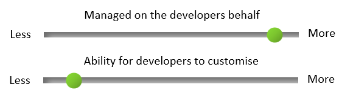

 

**Example of Self-Service services:**
- [Azure DevTest Labs][Azure DevTest Labs]
- [Azure Managed Apps][Azure Managed Apps]
- [Custom using Power App (see my MVP example)][Custom using Power App]

 

**Highly Managed Sandbox Properties:**
- Good for:
    - Minimal management overhead for developers
    - Pre-crafted / curated content
- Not so good for:
    - Developers that require more control and flexibility
- Controls:
    - [Azure Policy][Azure Policy] (Managed by Centeral IT Team on behalf of developers)
    - Self-Service capabilities (Managed by Centeral IT Team on behalf of developes)
 - Azure AD tenant:
    - Typically uses the existing Production tenant
- Subscription type:
     - EA (Enterprise Agreement) or [Enterprise DevTest][Enterprise DevTest] (for [Visual Studio subscribers][Visual Studio Subscription])
- Subscription instances:
    - Single (Shared)
- Life cycle:
    -   Typically short to medium term use (from the developers perspective)
- Subscription Quota:
    - Shared
    - Managed on behalf of developers by Centeral IT Team
- Owner / Management:
    - Management Group - Central IT team
    - Subscription - Central IT team
    - Foundation shared services - Central IT team
    - Self-service capabilities - Central IT team
    - DevTest Labs
        - Lab provisioning - Central IT team
        - Lab administration - Central IT team or Lab Admin
        - Lab resources - Lab Users
    - Managed Apps
        - App publisher - Central IT team or App Publisher
        - App consumer - Azure Active Directory User or Group
        - App administration - Central IT team or App Consumer
    - Power App (Custom)
        - Power App publisher - Central IT Team and/or Power App Publisher
- Resource Groups:
    - Resource Groups are managed on behalf of developers either by a Central IT Team and/or Self-Service services
- Virtual Machine Images:
    - Controlled/curated by Self-Service services (Service Admins)
    - [Azure Compute Gallery][Azure Compute Gallery] (Managed by a Centeral IT team on behalf of developers)
    - [Azure Marketplace Private Collections][Azure Marketplace Private Collections] (Managed by a Centeral IT Team on behalf of developers)
- Virtual Machine Management:
    - Active Directory Domain Services:
        - Can be Production Domain joined (Typically preferred to apply managed GPO (Group Policy Object) based configutation)
    - Patch Management:
        - Managed on behalf of developers by Central IT Team
- Networking:
    - Networking peered with Production: (Default)
        - Networking is managed on behalf of developers either by the Central IT Team and/or Self-Service services
    - Isolated network:
        - Networking is managed on behalf of developers either by the Central IT Team and/or Self-Service services
    - NSG (Network Security Groups) can either be enforced using Azure Policy by the Central IT Team and/or configured using the Self-Service services

 

**Images for Highly Managed Sandbox:**

    <a href="./images/dtl-overview-big.png">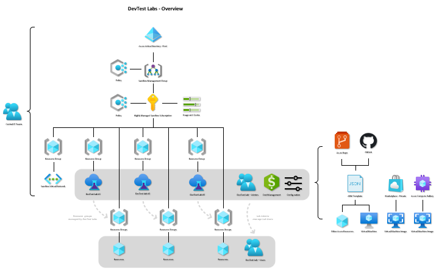</a>

  

    <a href="./images/dtl-networking-big.png">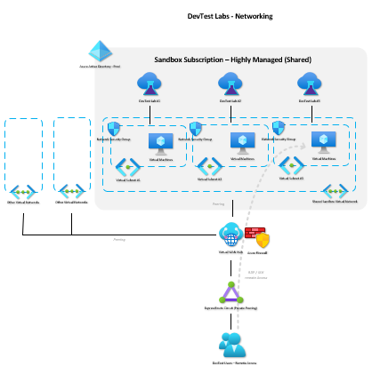</a>

  

    <a href="./images/ma-overview-big.png">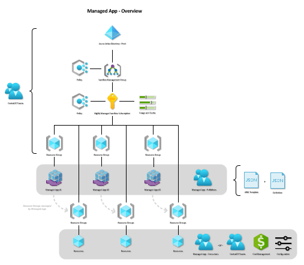</a>

  

    <a href="./images/custom-overview-big.png">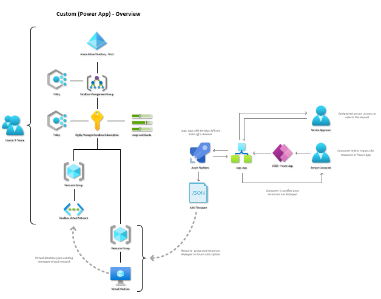</a>

 

---

 

    

### **Lightly Managed Sandbox:**
From a developer’s perspective, this is the middle ground where management is a responsibly shared between developers and Central IT Teams. This type of sandbox is designed mostly to provide a more flexible, managed sandbox environment compared to the ‘Highly Managed’ scenario.

This type of sandbox is intended for individual developers and/or development teams that require relatively simple and quick stand-up time but require a little more flexibility than that provided by the ‘Highly Managed’ sandbox.

One of the main differences between this type of sandbox compared to the 'Highly Managed' type is that developers can operate outside of typically more restrictive Self-Service services and can have a bit more freedom within the context of Resource Groups.

 
 

    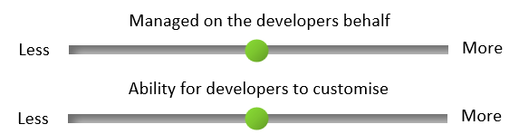

 
 

**Example of tooling:**
- First party declarative language [ARM][ARM] or preferably [Bicep][Bicep], or 3rd party language such as [Terraform][Terraform]
- [Azure Managed Apps][Azure Managed Apps]
- [Custom using Power App (see my MVP example)][Custom using Power App]

 

**Lightly Managed Sandbox Properties:**
- Good for:
    - Developing and testing new solutions where IaC templates don’t currently exist
    - More complex pre-crafted / curated content
- Not so good for:
    - Larger teams with relatively more complex workloads that require a higher degree of flexibility and autonomy
- Controls:
    - [Azure Policy][Azure Policy]: Management Group level: 
        - Managed on behalf of developers by Central IT Team
    - [Azure Policy][Azure Policy]: Subscription level:
        - Managed on behalf of developers by Central IT Team
    - Service Principals:
        - Life cycle managed on behalf of developers using [Azure AD Access Review][Azure AD Access Review]
 - Azure AD tenant:
    - Existing Production tenant
- Subscription type
     - EA (Enterprise Agreement) or [Enterprise DevTest][Enterprise DevTest] (for [Visual Studio subscribers][Visual Studio Subscription])
- Subscription instances:
    - Single (Shared)
- Life cycle:
    -   Typically medium to long term use (from the developers perspective)
- Subscription Quota:
    - Shared
    - Managed on behalf of developers by Centeral IT Team
- Owner / Management:
    - Management Groups - Central IT Team
    - Subscription - Central IT Team
    - Foundation shared services - Central IT Team
    - Provisioned resources - Individual project teams and Centeral IT Team
- Resource Groups:
    - Resource Groups are managed on behalf of developers either by Central IT teams and/or Self-Service services
- Virtual Machine Images:
    - Controlled/curated by Self-Service services (Service Admins)
    - [Azure Compute Gallery][Azure Compute Gallery] (Managed by a Centeral IT Team on behalf of developers)
    - [Azure Marketplace Private Collections][Azure Marketplace Private Collections] (Managed by a Centeral IT Team on behalf of developers)
- Virtual Machine Management:
    - Active Directory Domain Services:
        - Can be Production Domain joined (Exception based)
    - Patch Management:
        - Managed on behalf of developers by Central IT Team
- Networking:
    - Networking peered with Prod: (Exception based)
        - Networking is managed on behalf of developers either by a Central IT Team and/or Self-Service services
    - Isolated network: (Default)
        - Networking is managed by developers
    - NSG (Network Security Groups) can either be enforced using Azure Policy by a Central IT Team and/or configured using the Self-Service services

 

**Images for Lightly Managed Sandbox:**

    <a href="./images/light-overview-big.png">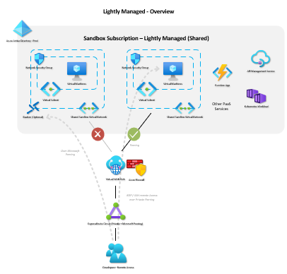</a>

 

---

 

    

### **Isolated Sandboxes - Dedicated:**
From a developer’s / project teams  perspective, things are mostly managed **by them** within this type of sandbox environment. An 'Isolated Sandbox' is designed mostly to provide dedicated, isolated environments which provide the highest degree of customisation and self-management that is largely the responsibility of the individual sandbox subscription owners/project teams.

This type of sandbox is intended for larger product / application development teams that require a much higher level of control without the resrictions that are typically present in more highly managed environments, and would prefer to cover most of the management overhead themselves.

Because this type of sandbox has less controls enforced and is not managed by a Centeral IT Team, it should be prevented from most forms of networking connectivity (or other integration) with other environments including Production and other restrictied enviromnets **without exception**.

 

> **Note:** In scenarios where workloads require integration into Production or other restrcited environmnets, it would typically be better to consider the ‘Lightly Managed’ sandbox type.

 

    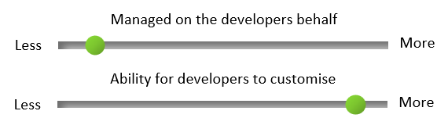

 

**Example Tooling:**
- First party declarative language [ARM][ARM] or preferably [Bicep][Bicep], or 3rd party language such as [Terraform][Terraform]
- [Azure Managed Apps][Azure Managed Apps]
- [Custom using Power App (see my MVP example)][Custom using Power App]

 

**Isolated Sandbox Properties:**
- Good for:
    - Product teams that require the most amount of autonomy and flexibility
    - When needing to work outside of other highly restrictive environments
- Not so good for:
    - Scenarios that require integration into Production or other restricted environments
- Controls:
    - [Azure Policy][Azure Policy]: Management Group level: 
        - Managed on behalf of developers by a Central IT Team
    - [Azure Policy][Azure Policy]: Subscription level:
        - Responsibility of the application / subscription owner(s)
    - Service Principals: Prod tenant:
        - Life cycle managed on behalf of developers using [Azure AD Access Review][Azure AD Access Review]
    - Service Principal: Non-Prod tenant:
        - Life cycle management is the responsibility of the application / subscription owner(s), suggest using [Azure AD Access Review][Azure AD Access Review]
 - Azure AD tenant:
    - Existing Prod tenant -or- separate tenant
- Subscription type
     - EA (Enterprise Agreement) or [Enterprise DevTest][Enterprise DevTest] (for [Visual Studio subscribers][Visual Studio Subscription])
- Subscription instances:
    - Multiple (per application / project team)
    - Consideration: [Azure Blueprints][Azure Blueprints] may be implemented by a Central IT Team to provide high-level Azure Policy, RBAC and foundation resources to quickly provision subsequent subscriptions
- Life cycle:
    -   Typically long term use (from the developers perspective)
- Subscription Quota:
    - The responsibility of the application / subscription owner(s)
    - Per subscription
- Owner / Management:
    - Management Groups - Central IT Team
    - Subscription(s) - Individual project teams
    - Foundation shared services - Responsibility of the application / subscription owner(s) or Central IT Team using [Azure Blueprints][Azure Blueprints] to scaffold new subscriptions
    - Provisioned resources - Individual project teams
- Resource Groups:
    - Resource Groups are the responsibility of the application / subscription owner(s)
- Virtual Machine Images:
    - [Azure Compute Gallery][Azure Compute Gallery] (Responsibility of the application / subscription owner(s) and/or Central IT Team)
    - [Azure Marketplace][Azure Marketplace]
- Virtual Machine Management:
    - Active Directory Domain Services:
        - Should not be Production Domain joined
        - Can provision and join isolated Domain that is the responsibility of the application / subscription owner(s)
    - Patch Management:
        - The responsibility of the application / subscription owner(s)
- Networking:
    - Networking peered with Prod: 
        - Should not be allowed
    - Isolated network: (Default)
        - Networking is the responsibility of the application / subscription owner(s)
    - NSG (Network Security Groups) are the responsibility of the application / subscription owner(s)

 

**Images for Isolated Sandbox:**

    <a href="./images/isolated-overview-big.png">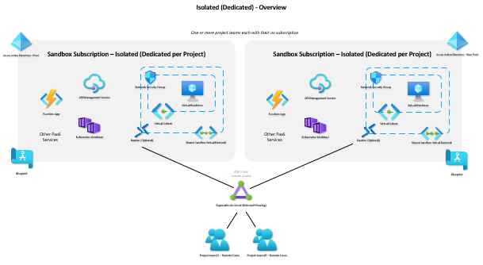</a>

 

---

 

## Reference Links
* [Wikipedia - Sandbox][Wikipedia]
* [Wikipedia - Data Exfiltration][Data Exfiltration]
* [Azure Policy][Azure Policy]
* [Enterprise DevTest Subscription][Enterprise DevTest]
* [Visual Studio Subscription][Visual Studio Subscription]
* [Azure DevTest Labs][Azure DevTest Labs]
* [Azure Managed Apps][Azure Managed Apps]
* [Custom self-service using Power App][Custom using Power App]
* [Azure Compute Gallery][Azure Compute Gallery]
* [Azure Marketplace][Azure Marketplace]
* [Azure Marketplace Private Collections][Azure Marketplace Private Collections]
* [ARM][ARM]
* [Bicep][Bicep]
* [Terraform][Terraform]
* [Azure AD Access Review][Azure AD Access Review]
* [Azure Blueprints][Azure Blueprints]

  

<!-- Local -->
[comparison]: downloads/compare-sandbox-types.pdf

<!-- External -->
[Wikipedia]: https://en.wikipedia.org/wiki/Sandbox_(software_development)#:~:text=A%20sandbox%20is%20a%20testing%20environment%20that%20isolates,development%20including%20Web%20development%20and%20revision%20control%20.
[data exfiltration]: https://en.wikipedia.org/wiki/Data_exfiltration
[Azure Policy]: https://docs.microsoft.com/en-us/azure/governance/policy/overview
[Enterprise DevTest]: https://azure.microsoft.com/en-gb/pricing/dev-test/#overview
[Visual Studio Subscription]: https://visualstudio.microsoft.com/subscriptions/
[Azure DevTest Labs]: https://azure.microsoft.com/en-us/services/devtest-lab/
[Azure Managed Apps]: https://azure.microsoft.com/en-us/services/managed-applications/#features
[Custom using Power App]: https://github.com/dazzlejim/PowerAppsVmRequester
[Azure Compute Gallery]: https://docs.microsoft.com/en-us/azure/virtual-machines/azure-compute-gallery
[Azure Marketplace]: https://azuremarketplace.microsoft.com/en-GB/
[Azure Marketplace Private Collections]: https://docs.microsoft.com/en-us/marketplace/create-manage-private-azure-marketplace-new
[ARM]: https://docs.microsoft.com/en-us/azure/azure-resource-manager/templates/
[Bicep]: https://docs.microsoft.com/en-us/azure/azure-resource-manager/bicep/overview?tabs=bicep
[Terraform]: https://docs.microsoft.com/en-us/azure/developer/terraform/overview
[Azure AD Access Review]: https://techcommunity.microsoft.com/t5/microsoft-entra-azure-ad-blog/introducing-azure-ad-access-reviews-for-service-principals/ba-p/1942488#:~:text=Setting%20up%20an%20access%20review%20for%20service%20principals,in%20the%20Azure%20portal%3A%20Navigate%20to%20Identity%20Governance.
[Azure Blueprints]: https://docs.microsoft.com/en-us/azure/governance/blueprints/overview
